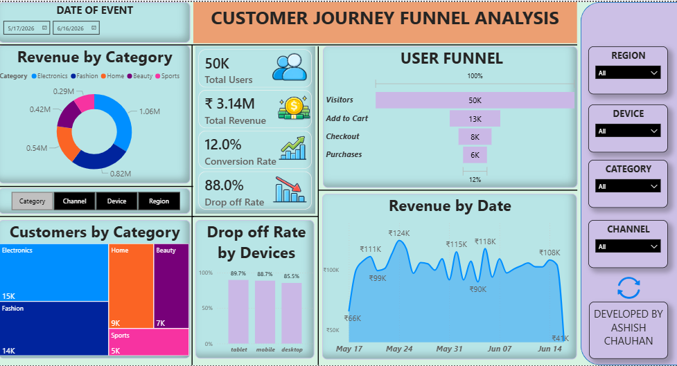

# 📊 Customer Journey Funnel Analysis

## 📌 Project Overview

This project analyzes user behavior across an e-commerce customer journey using **Power BI, Python, and SQL**. The objective is to identify conversion bottlenecks, measure funnel performance, and provide actionable recommendations to improve user experience and increase purchase conversions.

The dashboard tracks user progression through the following stages:

**Visitors → Add to Cart → Checkout → Purchase**

By analyzing user behavior across devices, regions, traffic channels, and product categories, the project uncovers key drop-off points and revenue-driving segments.

---

## 🎯 Business Problem

Many users visit an e-commerce platform but fail to complete a purchase.

This project aims to answer:

* Where do users drop off in the funnel?
* Which devices have the highest abandonment rates?
* Which marketing channels generate the most revenue?
* Which categories attract the most customers?
* What actions can improve conversion rates?

---

## 📂 Dataset

The dataset contains **50,000+ user sessions** and includes:

* User ID
* Session ID
* Event Stage
* Timestamp
* Device Type
* Region
* Traffic Channel
* Product Category
* Revenue
* Bounce Indicator

Dataset was generated and transformed using **Python (Pandas & Faker)** to simulate realistic user behavior.

---

## 🛠️ Tools & Technologies

* **Power BI**
* **Python**

  * Pandas
  * Faker
  * NumPy
* **SQL**
* **Excel**

---

## 📈 Dashboard Features

### Executive KPIs

* Total Users
* Total Revenue
* Conversion Rate
* Drop-off Rate

### Funnel Analysis

* Visitors
* Add to Cart
* Checkout
* Purchases

### Segmentation Analysis

* Device Performance
* Region Performance
* Traffic Channel Analysis
* Category Analysis

### Revenue Analysis

* Revenue by Category
* Revenue Trend Over Time

### Interactive Filters

* Date
* Region
* Device
* Category
* Channel

---

## 🔍 Key Insights

* Overall conversion rate of **12%**
* Checkout stage contributes significantly to user drop-offs
* Electronics category generates the highest revenue
* Device-specific analysis highlights varying abandonment behavior
* Marketing channel performance impacts conversion outcomes

---

## 💡 Business Recommendations

* Simplify checkout experience
* Reduce unnecessary form fields
* Improve mobile user experience
* Optimize CTA placement
* Enhance high-performing acquisition channels
* Implement targeted retention campaigns

---

## 📸 Dashboard Preview



---

## 📁 Repository Structure

```text
CUSTOMER-JOURNEY-FUNNEL-ANALYSIS/
│
├── Funnel_Data_generation.ipynb
├── Funnel_EDA.ipynb
├── user_journey_funnel.csv
├── user_journey_funnel_cleaned.xlsx
├── funnel_analysis_dashboard.pbix
├── funnel_dash_preview.png
└── README.md
```

---

## 🚀 Project Outcome

Developed an end-to-end customer journey analytics solution that transforms raw user activity into actionable business insights. The project demonstrates skills in data generation, data cleaning, exploratory analysis, KPI development, dashboard design, and business storytelling.

---

## 👨‍💻 Author

**Ashish Chauhan**

* GitHub: https://github.com/not-ashishchauhan
* LinkedIn: https://www.linkedin.com/in/not-ashishchauhan
